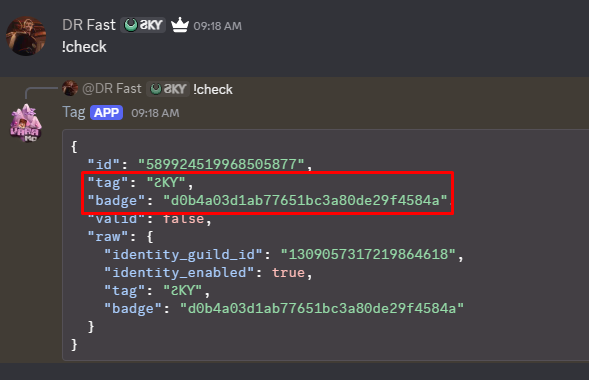

# Discord Clan Tag Automator

A simple, multi-threaded Discord bot designed to manage roles based on Discord Clan Tags and Badges. It uses a main bot for role management and multiple scanner bots to bypass aggressive rate limits on large servers.

## Setup
1. **Install dependencies:**
   ```bash
   npm install
   ```
2. **Configure everything in `config.js`:**
   Everything you need is in one place. No need for `.env` files.
   
   - **tokens:** Add your bot tokens in the array. 
     - **Note:** Adding more bots to the list makes scanning much faster and more efficient.
     - The **first** token is the "Main" bot (needs Manage Roles permission).
     - Other tokens are "Scanner" bots (just need to view the server).
   - **tag / badge:** The exact clan tag and badge hash (use `!check` to find them).
   - **roleId:** The ID of the role to give to members.
   - **targetChannelId:** The channel where the bot listens for the tag in real-time.

3. **Run it:**
   ```bash
   node . 
   ```

## Configuration Guide (`config.js`)
The configuration is designed to be self-explanatory:
- `scanIntervalMs`: How often the bot scans the whole server (e.g., 120000 = 2 minutes).
- `requestDelayMs`: Delay between checking each user. **Don't make this too low** or you'll get banned by Discord.
- `scanOfflineMembers`: Set to `true` if you want the bot to check everyone, even if they aren't online.

## How to get the Clan Tag & Badge
You need the exact `tag` and `badge` hash for the bot to work.

### Method 1: Using the Bot (Easiest)
1. Have someone with the desired clan tag send a message.
2. Type `!check @user` or `!check ID`.
3. The bot will reply with a JSON block. Look for the `"tag"` and `"badge"` values.
   - **Note:** Only users with **Administrator** permission can use this command.



Example of what to put in `config.js`:
```javascript
tag: "ϨⲔⲨ",
badge: "d0b4a03d1ab77651bc3a80de29f4584a",
```

### Method 2: Inspect Element
1. Open Discord in your browser (Chrome/Edge).
2. Press `F12` -> **Network** tab.
3. Filter by `users`.
4. Click on the profile of someone who has the clan tag.
5. The API response contains a `clan` object with the `tag` and `badge`.

---
Built for efficiency. Use responsibly.
